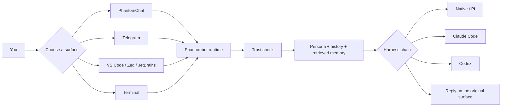
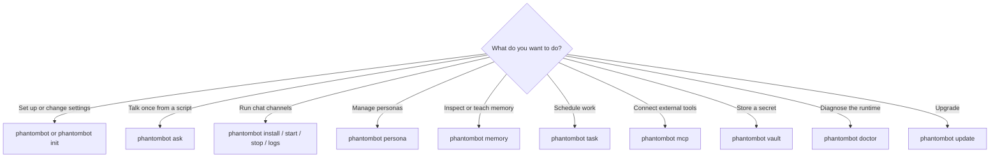
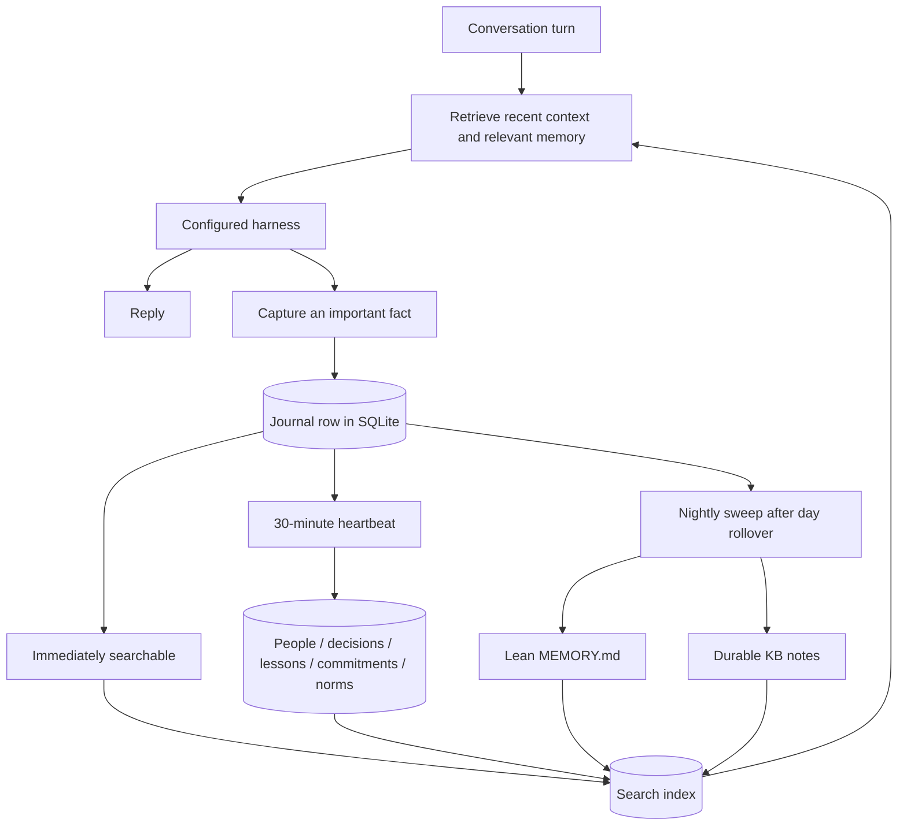

# Phantombot

**A persistent, local-first AI persona for your terminal, chats, and editor.**

Phantombot gives an AI coding harness a durable identity, long-term memory,
secure credentials, scheduled work, and multiple ways to reach you. Use the
same persona from PhantomChat, Telegram, a terminal, VS Code, Zed, or JetBrains
without starting from zero each time.

It ships with a native AI harness and can also use your existing Pi, Claude
Code, or Codex installation. The harness keeps its own tools; Phantombot owns
the runtime around it: identity, memory, channels, trust, scheduling, voice,
and updates.

## Highlights

| | |
|---|---|
| **One continuous persona** | The same identity, preferences, and context across chat, terminal, and editor sessions. |
| **Memory that compounds** | Local journals, structured decisions and lessons, durable knowledge, and meaning-based retrieval. |
| **Bring your own brain** | Built-in native harness, plus Pi, Claude Code, and Codex as primary or fallback options. |
| **Safe by origin** | Trusted owners act directly; untrusted email, webhooks, and bridges are screened before a capable model runs. |
| **Real background work** | Persistent scheduled tasks, health checks, notifications, and service management survive restarts. |
| **Local control** | Persona state and encrypted secrets stay on your machine. Model-provider privacy terms still apply to prompts sent to that provider. |

## How it fits together



Phantombot does not add a second tool-calling framework. It assembles the right
context, selects the configured harness, persists the result, and routes the
reply back to where the conversation started.

## Install

Linux and macOS:

```bash
curl -fsSL https://raw.githubusercontent.com/phantomyard/phantombot/main/install.sh | sh
```

Windows PowerShell:

```powershell
iex ((iwr -useb https://raw.githubusercontent.com/phantomyard/phantombot/main/install.ps1).Content.TrimStart([char]0xFEFF))
```

Both installers download the latest stable release, verify its checksum, run
the binary, open setup, and register the platform service. Windows supports
x64 and arm64 and uses Task Scheduler for background services.

> [!TIP]
> The native harness is included. You only need a supported provider API key.
> Pi, Claude Code, and Codex are optional host harnesses.

## Five-minute setup

Run the unified setup app:

```bash
phantombot
```

Or configure each part directly:

```bash
phantombot persona          # create or import a persona
phantombot harness          # choose the brain and fallbacks
phantombot phantomchat      # encrypted Nostr messages (optional)
phantombot telegram         # Telegram bot and owner allowlist (optional)
phantombot voice            # speech-to-text and voice replies (optional)
phantombot embedding        # semantic memory provider (optional)
phantombot install          # install and start the background service
```

No chat channel is required. You can use Phantombot entirely from a terminal
or editor:

```bash
phantombot ask "Summarize this repository"
phantombot acp install vscode
phantombot acp install zed
phantombot acp install jetbrains
```

Check that everything is healthy:

```bash
phantombot doctor
phantombot logs --no-follow
```

## Which command do I need?



### Command map

| Command | Use it for |
|---|---|
| `phantombot` | Open the terminal app and setup UI. |
| `phantombot persona` | Create, import, list, or switch personas. |
| `phantombot harness` | Configure native or host harnesses and fallbacks. |
| `phantombot telegram` | Configure Telegram and its owner allowlist. |
| `phantombot phantomchat` | Configure encrypted PhantomChat messaging. |
| `phantombot voice` | Configure speech-to-text and text-to-speech. |
| `phantombot ask "…"` | Run a one-shot local prompt. |
| `phantombot acp install …` | Add Phantombot to a supported editor. |
| `phantombot memory …` | Search, capture, inspect, back up, or restore memory. |
| `phantombot task …` | Add, inspect, cancel, or audit scheduled work. |
| `phantombot mcp …` | Discover and use external integrations lazily. |
| `phantombot vault …` | Manage encrypted persona-scoped credentials. |
| `phantombot notify …` | Send a material background update to configured owners. |
| `phantombot doctor` | Check channels, timers, connectors, harnesses, and memory health. |
| `phantombot start\|stop\|restart\|logs` | Manage the installed service. |
| `phantombot update` | Check for or install a verified release. |

Use live help for flags and subcommands; it is always more current than copied
documentation:

```bash
phantombot --help
phantombot <command> --help
```

## Memory, without the wall of text

Each persona owns its memory. Recent conversations live in a bounded SQLite
store; durable knowledge lives in structured drawers, a lean `MEMORY.md`, and
an Open Knowledge Format knowledge base. Search works locally with weighted
lexical retrieval and link expansion. Optional embeddings add semantic search.



The useful commands are deliberately small:

```bash
phantombot memory search "deployment rollback"
phantombot memory capture "Production uses blue-green deploys" --tag decision
phantombot memory drawers --kind decisions
phantombot memory journal --date 2026-10-04
phantombot memory index
phantombot memory backup
phantombot doctor
```

Five capture tags are supported: `decision`, `lesson`, `person`, `commitment`,
and `norm`. The heartbeat and nightly sweep promote and distil them; agents do
not need to hand-maintain drawer files.

For the storage model and lifecycle details, see
[`docs/concepts/memory-lifecycle.md`](docs/concepts/memory-lifecycle.md).

## Channels and editors

- **[PhantomChat](https://github.com/phantomyard/phantomchat)** — encrypted
  Nostr text and voice messages on desktop and mobile.
- **Telegram** — text, voice, groups, attachments, and notifications.
- **VS Code, Zed, and JetBrains** — the same persona through ACP, with editor
  workspace context.
- **Terminal** — interactive TUI, plain REPL, or one-shot `ask` calls.

Multiple personas can run inside one daemon. Each has isolated identity,
memory, channels, harness settings, and credentials.

## Scheduled work

Tasks are stored in SQLite, survive restarts, and keep a run history:

```bash
# One-off
phantombot task add "Remind me to call Sam" "Call Sam" --in 30m

# Recurring
phantombot task add "Check the release pipeline" "Release check" --every 1h --for 8h

# Inspect
phantombot task list
phantombot task log "$TASK_ID"
phantombot task cancel "$TASK_ID"
```

Deterministic pollers can use `--command` to run without waking a model. Use
`phantombot notify` only when background work produces something the owner
actually needs to see.

## Integrations and secrets

MCP integrations are persona-scoped and discovered only when needed:

```bash
phantombot mcp search "GitHub pull requests"
phantombot mcp describe github
phantombot mcp call github TOOL_NAME --args '{"key":"value"}'
```

Credentials belong in the encrypted vault, not in notes or config files:

```bash
printf '%s' "$API_KEY" | phantombot vault set API_KEY
phantombot vault list
```

See [`docs/how-to/mcp.md`](docs/how-to/mcp.md) for connection and
authentication options.

## Security model

Phantombot decides trust from **where a request came from**, not how polite it
looks.

- Allow-listed owners and local editor sessions are trusted.
- Chat commands (`/update`, `/restart`, `/reset`, `/harness`, …) answer only
  an authenticated owner, on every channel. From a sender who is answered but
  is not an owner — a Telegram bot or PhantomChat persona with no allowlist, a
  PhantomChat bridge — a message starting with `/` is ordinary screened input,
  not a command.
- Email, webhooks, bridge traffic, and other ambient inputs are untrusted.
- Untrusted requests pass through a capability-restricted threat judge before
  the capable harness receives conversation history or retrieved knowledge.
- Suspicious requests are held and surfaced to the owner for a trusted
  conversation. The judge is the only gate on autonomous work: a request it
  passes is carried through without a second approval step.
- Secrets are encrypted per persona with AES-256-GCM.

This reduces the attack surface; it does not make an autonomous model
infallible. Prompts and tool calls still go to the model provider you choose,
under that provider's privacy and retention terms.

## Harnesses

| Harness | Role |
|---|---|
| **native** | Built in and recommended; uses configured API providers and supports primary, vision, and coding model routing. |
| **pi-host** | Uses an existing Pi installation and its host configuration. |
| **claude** | Uses Claude Code as a primary or fallback harness. |
| **codex** | Uses Codex CLI as a primary or fallback harness. |

Phantombot never installs an optional host harness for you. Missing fallbacks
do not stop the daemon; `phantombot doctor` reports what is available.

## Build and embed

Released binaries do not require Bun. Building from source does:

```bash
git clone https://github.com/phantomyard/phantombot.git
cd phantombot
bun install
bun tsc --noEmit
bun test
bun run build
```

The engine can also be embedded in a Bun/TypeScript application with isolated
state, explicit trust, memory, harness fallback, and validated decisions. See
[`docs/reference/engine.md`](docs/reference/engine.md).

## Documentation

- [`docs/README.md`](docs/README.md) — indexed guides for setup, daily use,
  operations, concepts, and the engine API.
- [`AGENTS.md`](AGENTS.md) — contributor invariants, repository architecture,
  and lessons written in blood.
- `phantombot <command> --help` — authoritative flags, defaults, and command
  syntax for the installed version.

## Contributing

Read [`AGENTS.md`](AGENTS.md) before changing code. Keep behavior, tests, and
documentation aligned.

```bash
bun install
bun tsc --noEmit
bun test
bun run build
```

Phantombot is built by [Phantomyard](https://github.com/phantomyard).
