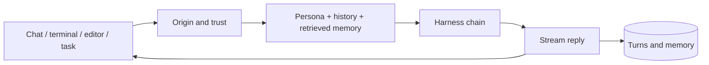

# Architecture

Phantombot is the runtime around an AI harness. It owns identity, trust,
context, memory, channels, scheduling, service lifecycle, and updates. The
harness owns model interaction and tools.

## Turn flow

1. A channel adapter, ACP session, terminal, or scheduled task creates a turn
   with an explicit persona, conversation, origin, and working directory.
2. Untrusted origins pass through the capability-restricted threat screen.
   Trusted principals and local interactive surfaces proceed directly.
3. The runtime loads persona files, recent conversation history, durable facts,
   daily recall, and relevant indexed memory.
4. The configured harness chain runs in order. Each harness receives the same
   trust and tool policy. Recoverable failures can fall through; a partial turn
   is resumed carefully rather than blindly repeated.
5. Text and progress stream back through the original surface. Successful
   turns are persisted and indexed; failed or held turns do not masquerade as
   successful conversation history.

## Runtime surfaces

- **Channels:** a channel-neutral streaming core with Telegram and PhantomChat
  adapters. IDs become strings at the adapter boundary.
- **Terminal:** an interactive full-screen TUI, plain non-TTY behavior, and
  one-shot `ask` calls.
- **Editors:** ACP over stdio for VS Code, Zed, and JetBrains.
- **Background work:** SQLite-backed tasks fired by the platform scheduler,
  with heartbeat and nightly maintenance.
- **Engine:** an embeddable Bun/TypeScript facade scoped by
  `AsyncLocalStorage`, never by mutating global location or credential state.

## Isolation

A host can serve several personas in one process. Each persona has its own
identity, configuration overlay, channel identities, vault, memory, knowledge
base, and harness overrides. Spawn environments are assembled per persona;
scoped secrets do not enter global `process.env`.

## Memory subsystem

Conversation turns and journal entries live in SQLite. Tagged captures are
promoted to five structured drawers. A nightly sweep distils closed days into
the drawers, lean long-term memory, and Open Knowledge Format notes. Retrieval
uses weighted lexical search and link expansion by default, with optional
semantic embeddings fused into the ranking. See [Memory lifecycle](memory-lifecycle.md).

## Service model

One `phantombot run` process serves the configured personas. Linux uses systemd
user units, macOS uses launchd, and Windows uses Task Scheduler. The same CLI
controls lifecycle on every platform. The turn registry and advisory workspace
locks coordinate separate processes without turning a stale lock into a
permanent outage.

For contributor-level module maps and invariants, read [AGENTS.md](../../AGENTS.md).
