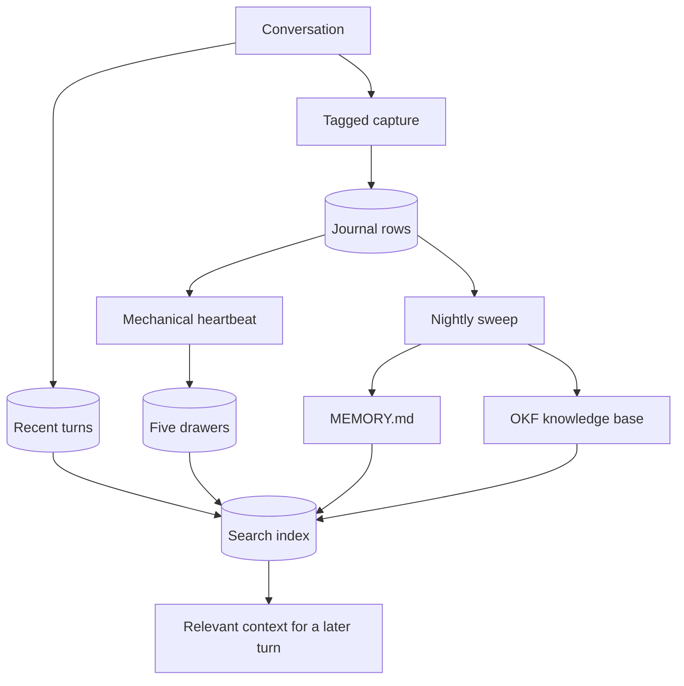

# Memory lifecycle

Phantombot memory has three jobs: keep the active conversation coherent,
capture facts worth carrying forward, and retrieve only the durable context
relevant to the next turn.

## Recent conversation

Successful user and assistant turns are stored in SQLite and read back within
bounded history. When old turns leave the prompt window they remain searchable;
they are not the same thing as durable facts.

## Journal and captures

`phantombot memory capture` writes one journal row with zero or more tags. It
is indexed immediately. The tags are `decision`, `lesson`, `person`,
`commitment`, and `norm`.

Today's journal is injected because the day is still open. Yesterday is also
included when its nightly sweep did not finish. Selection is enforced in code,
not left to a persona prompt. The prompt uses bounded whole entries and keeps
the newest material.

## Five drawers

People, decisions, lessons, commitments, and norms are structured database
rows with ranking, decay, and supersession. The heartbeat promotes tagged
captures into them. They are not Markdown files and should not be hand-edited.
Norms and prior rulings also brief the threat judge.

## Nightly distillation

After day rollover, the cognitive sweep processes closed journal days into the
drawers, a lean `MEMORY.md`, and linked Open Knowledge Format notes under `kb/`.
It is checkpointed and idempotent: a healthy completed day is not repeatedly
reprocessed, while a changed or incomplete day is retried.

## Retrieval

The always-on index uses field-weighted lexical search plus wiki-link graph
expansion. Optional embeddings add a semantic result set; reciprocal-rank
fusion combines it with lexical results. Semantic indexing sends the plaintext
being embedded to the configured provider, so enabling it is a privacy choice.

See [Work with memory](../how-to/memory.md) for commands and backups.
